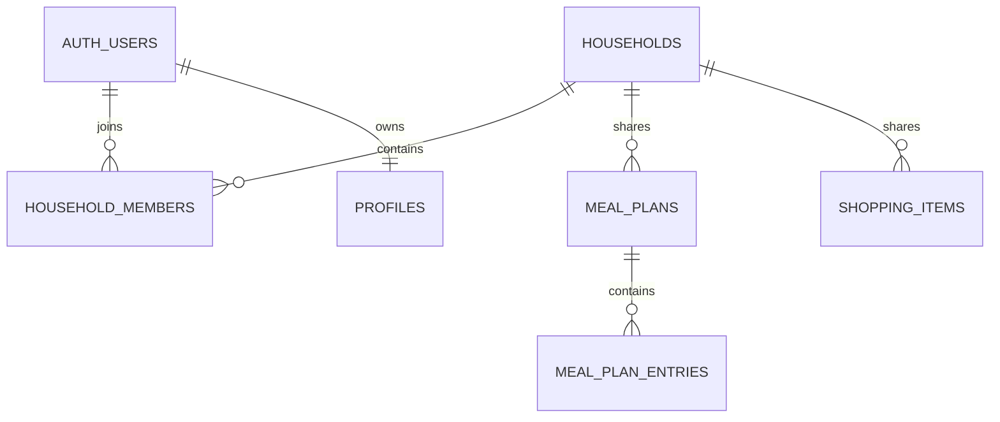

# Aktuelles Supabase-Backend

Stand: 4. August 2026

## Projekt

- Projektname im Dashboard: `D1 DayOne`
- Projekt-ID: `rfdtjodpjvynnavnucvu`
- Region: `eu-central-1`
- Status bei Erstellung dieses Handoffs: `ACTIVE_HEALTHY`
- PostgreSQL: 17

Das Frontend enthält eine öffentliche/anon Client-ID. Es enthält keinen `service_role`- oder Secret-Key. Private Tabellenzeilen wurden nicht in dieses Paket exportiert.

## Relevantes Datenmodell

| Tabelle | Zweck | Wichtige Schlüssel |
|---|---|---|
| `profiles` | persönliches Ernährungs-/Zielprofil | `user_id` → `auth.users.id` |
| `user_state` | kompletter persönlicher App-State als JSONB | `user_id`, `schema_ver` |
| `households` | Haushalt und Einladungscode | `id`, `invite_code`, `created_by` |
| `household_members` | Zuordnung User ↔ Haushalt | PK `(household_id, user_id)` |
| `meal_plans` | persönlicher oder gemeinsamer Plan pro Woche | `id`, `household_id`, `owner_id`, `week_start` |
| `meal_plan_entries` | einzelne Gerichte im Plan | `meal_plan_id`, `day_date`, `category`, `recipe_id`, `prep_group` |
| `meal_entry_status` | persönlicher Status/Portionsfaktor je Eintrag | PK `(entry_id, user_id)` |
| `shopping_items` | persönliche oder gemeinsame Einkaufsposten | `household_id`, `owner_id`, `meal_plan_id`, `checked` |
| `custom_recipes` | eigene Rezepte eines Users/Haushalts | `owner_id`, `household_id` |
| `gamification` | Legacy-XP/Streak | nicht Teil des sichtbaren Zielprodukts |
| `weight_logs`, `water_logs` | Legacy-Tracking | nicht Teil des sichtbaren Kernprodukts |

Alle genannten Tabellen hatten beim Abruf RLS aktiviert. Die gemeldeten Tabellenzählungen waren 0; dieses Handoff enthält keine Nutzerdaten.

## Beziehungen

## Zwei getrennte Sync-Pfade

### Persönlicher Cloud-Sync

Das Frontend speichert einen großen JSONB-State in `user_state`. Zusätzlich werden einzelne persönliche Daten in `profiles`, `gamification`, `weight_logs` und `water_logs` geschrieben. Teile davon sind für das Food-Only-Ziel Legacy.

### Haushalt

1. `create_household(p_name)` legt Haushalt und Owner-Mitgliedschaft an.
2. Die UI zeigt einen Code als `PREP-XXXXXX`.
3. Vor `join_household(p_code)` entfernt das Frontend die Präfixe `D1-`, `PREP-` oder `PREPLY-`.
4. Ein gemeinsamer Plan wird über `meal_plans` und `meal_plan_entries` gespeichert.
5. Einkaufs-Häkchen werden über `shopping_items` geteilt.
6. Das Frontend lädt beim Öffnen/Tabwechsel/Fokus, alle ca. 30 Sekunden und manuell neu.

Das ist Polling, kein echtes Realtime-Abonnement.

## Aktuelle RLS-Idee

- persönliche Tabellen: `user_id = auth.uid()`
- Haushaltsdaten: Zugriff, wenn `household_id` in `user_household_ids()` liegt
- `meal_plan_entries`: Zugriff wird über den zugehörigen Plan abgeleitet
- `meal_entry_status`: pro User getrennt

Die Policies sind derzeit vielfach für die Rolle `public` angelegt und verlassen sich auf `auth.uid()`-Prädikate. Das sollte vor breiter Veröffentlichung gezielt überprüft und auf den tatsächlich benötigten Rollen-/Operationsumfang beschränkt werden.

## Bekannte funktionale Lücke

Der gemeinsame Plan enthält Rezept-IDs, aber die Einkaufsmengen werden im Client weiterhin aus dem persönlichen Profil berechnet. Es gibt noch keine robuste Aggregation wie:

`gemeinsame Menge = Bedarf Person A + Bedarf Person B + weitere Mitglieder`

Für diese Erweiterung braucht jedes Mitglied ein belastbares persönliches Portions-/Bedarfsprofil und eine deterministische Zuordnung der Zutaten zum gemeinsamen Plan.

## Migrationen

Beim Abruf war eine Migration gelistet:

- `20260727135541_create_recipes_table`

Die Live-Struktur enthält darüber hinaus mehrere Tabellen und Funktionen. Eine neue KI darf deshalb nicht annehmen, dass die Migrationshistorie den gesamten Ist-Zustand vollständig reproduziert.

